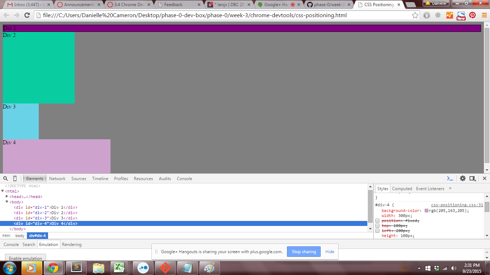

Release 2: Positioning

#### 1. Change the Colors

#### 2. Column

#### 3. Row

#### 4. Make Equidistant

#### 5. Squares

#### 6. Footer

#### 7. Header

#### 8. Sidebar

#### 9. Get Creative

How can you use Chrome's DevTools inspector to help you format or position elements?
Chrome DevTools allows you to change the css without changing your original css. This is a great testing feature and also allows you
to view the elements padding, margin, content by hovering over the element.
How can you resize elements on the DOM using CSS?
You can resize by changing the width and height in element.style{}
What are the differences between Absolute, Fixed, Static, and Relative positioning? Which did you find easiest to use? Which was most difficult?
Absolute: forces an element to be positioned on the page resulting from the padding & margins. 
Fixed: Locks the element on the page. When scrolling it will stay in the same position. 
What are the differences between Margin, Border, and Padding?
Static: Is the default. It gets dumped on the page in the order of the css. Right, left, top and bottom do not apply.
Relative: the element is relative to the other elements on the page and their margins, padding etc.
Relative is the hardest for me.
What are the differences between Margin, Border, and Padding?
Margin: Is a transparent space that surrounds the area outside the border
Padding: is a trasparent space the surrounds the content.
Border: Is a border that goes around the content and padding.
What was your impression of this challenge overall? (love, hate, and why?)
Love, perfect for testing and seeing the relationship being elements
