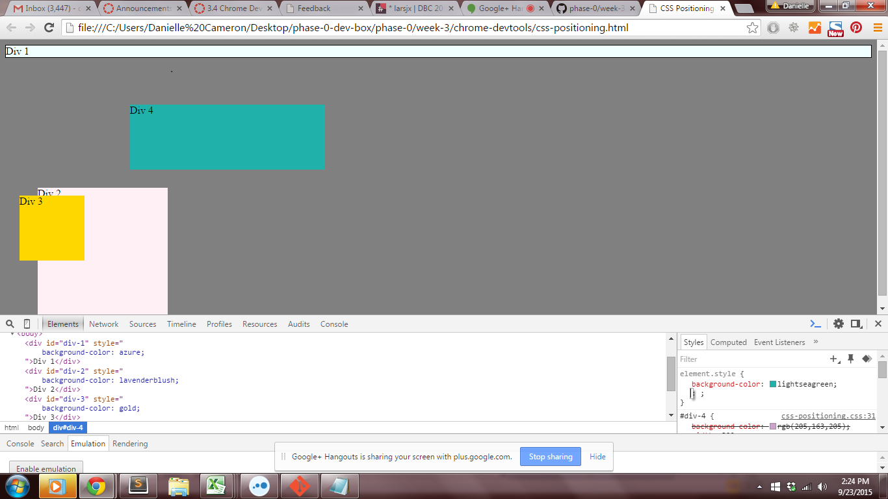
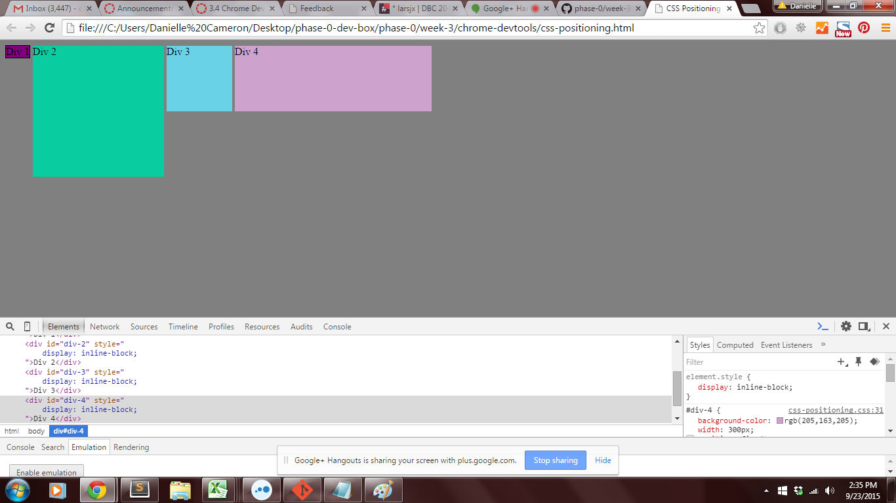
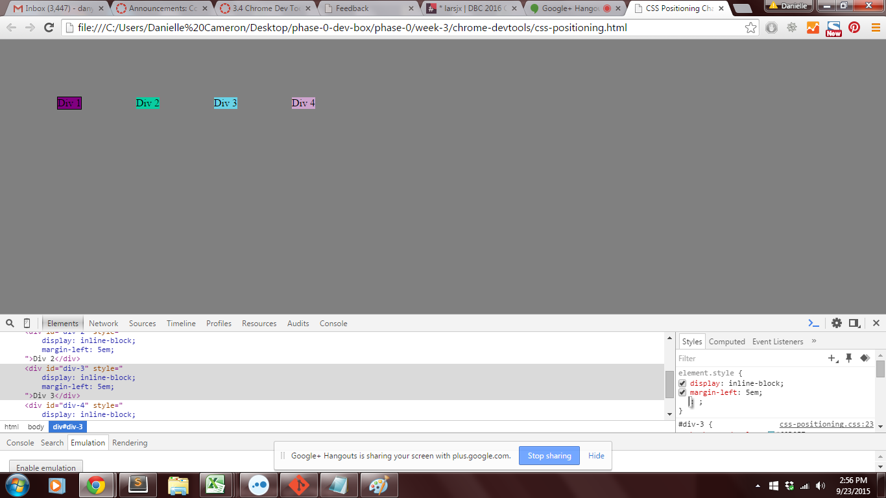
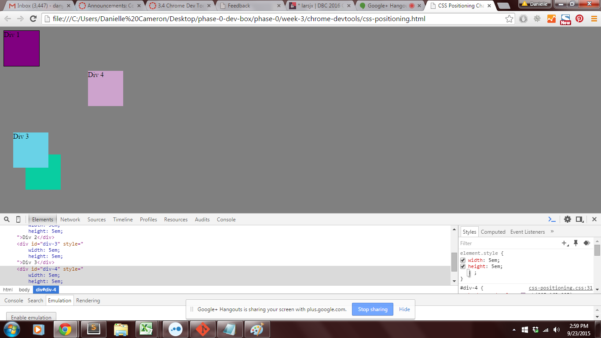
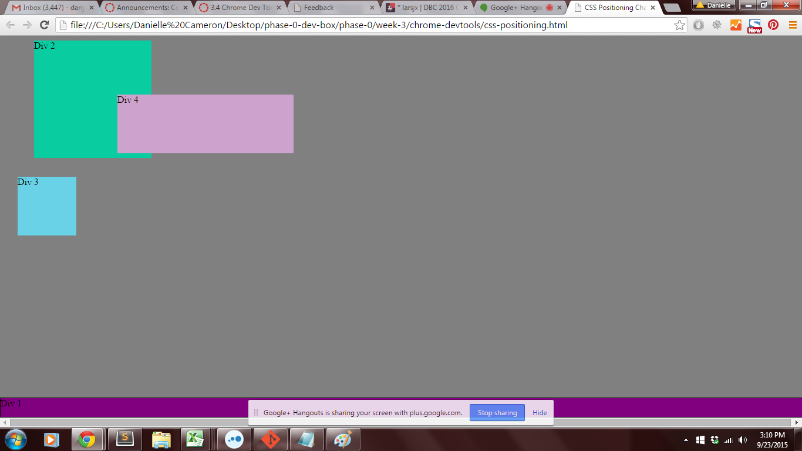
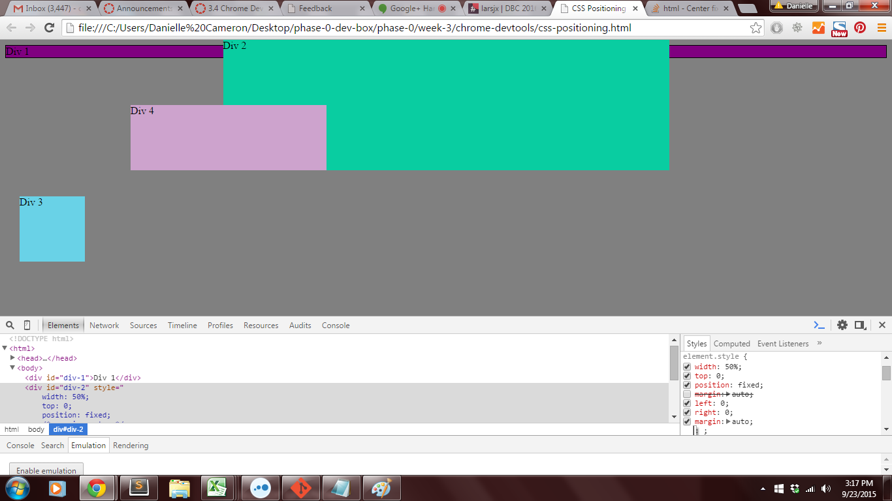
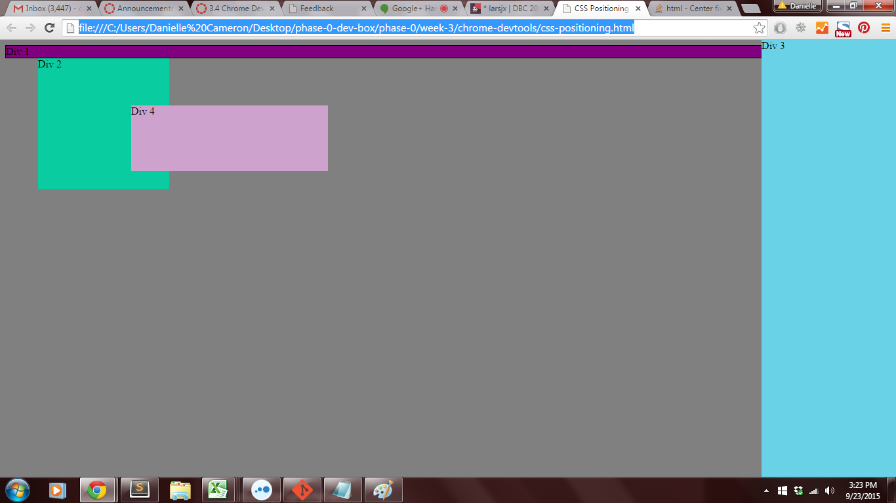
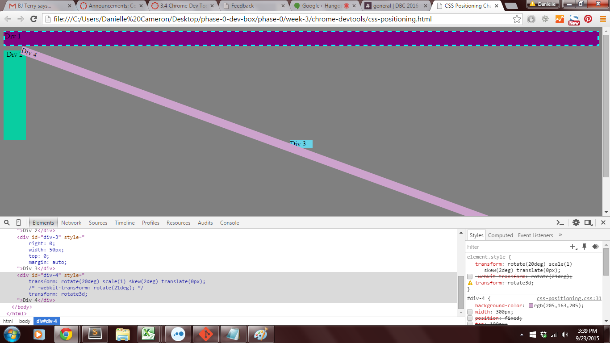

Release 2: Positioning

#### 1. Change the Colors

#### 2. Column

#### 3. Row

#### 4. Make Equidistant

#### 5. Squares

#### 6. Footer

#### 7. Header

#### 8. Sidebar

#### 9. Get Creative

