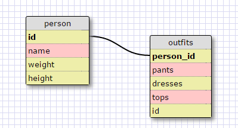

Release 5"
1. SELECT * FROM states;

2. SELECT * FROM regions;

3. SELECT state_name , population FROM states;

4. SELECT state_name, population FROM states ORDER BY population DESC;

5. SELECT state_name FROM states WHERE region_id = 7;

6. SELECT state_name , population_density FROM states WHERE population_density > 50 ORDER BY population_density;

7. SELECT state_name FROM states WHERE population BETWEEN 1000000 AND 1500000;

8. SELECT state_name , region_id FROM states ORDER BY region_id;

9. SELECT region_name FROM regions WHERE region_name LIKE '%Central';

10.SELECT regions.region_name , states.state_name FROM states JOIN states.region_id = regions.id ORDER BY region_id;

Reflection:
What are databases for? Databases are used to store data in tables. They use relationships to cut down on processing time.
What is a one-to-many relationship?
A one to many relations is where one thing can refer to many things.
What is a primary key? What is a foreign key? How can you determine which is which? A primary key is a unique identifier. A forgien key points to a primary key in another table. There can only be one primary key in a table.
How can you select information out of a SQL database? What are some general guidelines for that? SELECT FROM WHERE are keywords to get information out of an SQl database. 